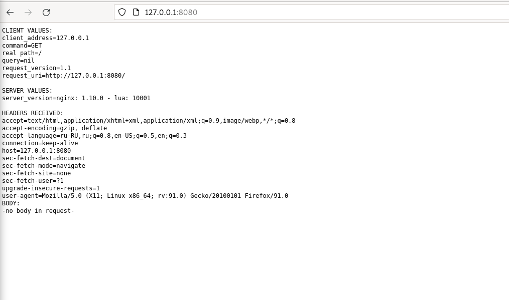

1. Установить Minikube

```commandline
vlad@home:~/Documents/Netology/DevOps/dz_№55$ minikube version
minikube version: v1.27.0
commit: 4243041b7a72319b9be7842a7d34b6767bbdac2b

```

2.Запуск Hello World
- Развертывание тестового приложения
```commandline
vlad@home:~/Documents/Netology/DevOps/dz_№55$ kubectl get deployments
NAME         READY   UP-TO-DATE   AVAILABLE   AGE
hello-node   1/1     1            1           8m40s
```
- установка addons
```commandline
lad@home:~/Documents/Netology/DevOps/dz_№55$ minikube addons list
|-----------------------------|----------|--------------|--------------------------------|
|         ADDON NAME          | PROFILE  |    STATUS    |           MAINTAINER           |
|-----------------------------|----------|--------------|--------------------------------|
| ambassador                  | minikube | disabled     | 3rd party (Ambassador)         |
| auto-pause                  | minikube | disabled     | Google                         |
| csi-hostpath-driver         | minikube | disabled     | Kubernetes                     |
| dashboard                   | minikube | enabled ✅   | Kubernetes                     |
| default-storageclass        | minikube | enabled ✅   | Kubernetes                     |
| efk                         | minikube | disabled     | 3rd party (Elastic)            |
| freshpod                    | minikube | disabled     | Google                         |
| gcp-auth                    | minikube | disabled     | Google                         |
| gvisor                      | minikube | disabled     | Google                         |
| headlamp                    | minikube | disabled     | 3rd party (kinvolk.io)         |
| helm-tiller                 | minikube | disabled     | 3rd party (Helm)               |
| inaccel                     | minikube | disabled     | 3rd party (InAccel             |
|                             |          |              | [info@inaccel.com])            |
| ingress                     | minikube | enabled ✅   | Kubernetes                     |
| ingress-dns                 | minikube | disabled     | Google                         |
| istio                       | minikube | disabled     | 3rd party (Istio)              |
| istio-provisioner           | minikube | disabled     | 3rd party (Istio)              |
| kong                        | minikube | disabled     | 3rd party (Kong HQ)            |
| kubevirt                    | minikube | disabled     | 3rd party (KubeVirt)           |
| logviewer                   | minikube | disabled     | 3rd party (unknown)            |
| metallb                     | minikube | disabled     | 3rd party (MetalLB)            |
| metrics-server              | minikube | disabled     | Kubernetes                     |
| nvidia-driver-installer     | minikube | disabled     | Google                         |
| nvidia-gpu-device-plugin    | minikube | disabled     | 3rd party (Nvidia)             |
| olm                         | minikube | disabled     | 3rd party (Operator Framework) |
| pod-security-policy         | minikube | disabled     | 3rd party (unknown)            |
| portainer                   | minikube | disabled     | 3rd party (Portainer.io)       |
| registry                    | minikube | disabled     | Google                         |
| registry-aliases            | minikube | disabled     | 3rd party (unknown)            |
| registry-creds              | minikube | disabled     | 3rd party (UPMC Enterprises)   |
| storage-provisioner         | minikube | enabled ✅   | Google                         |
| storage-provisioner-gluster | minikube | disabled     | 3rd party (Gluster)            |
| volumesnapshots             | minikube | disabled     | Kubernetes                     |
|-----------------------------|----------|--------------|--------------------------------|
vlad@home:~/Documents/Netology/DevOps/dz_№55$ 
```
3. Установить kubectl
- подключиться к minikube
```commandline
vlad@home:~/Documents/Netology/DevOps/dz_№55$ kubectl get nodes
NAME       STATUS   ROLES           AGE   VERSION
minikube   Ready    control-plane   22m   v1.25.0
vlad@home:~/Documents/Netology/DevOps/dz_№55$ kubectl get pods
NAME                         READY   STATUS    RESTARTS   AGE
hello-node-697897c86-dl5tc   1/1     Running   0          11m
```
- проверить работу приложения из задания 2, запустив port-forward до кластера
```commandline
vlad@home:~/Documents/Netology/DevOps/dz_№55$ kubectl port-forward pods/hello-node-697897c86-dl5tc 8080:8080
Forwarding from 127.0.0.1:8080 -> 8080
Forwarding from [::1]:8080 -> 8080
Handling connection for 8080
```
